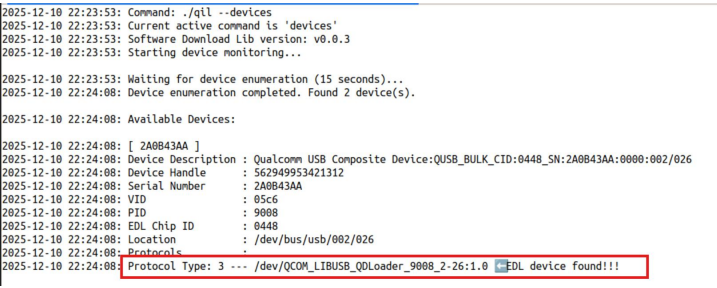
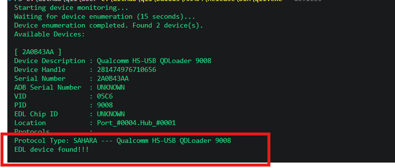
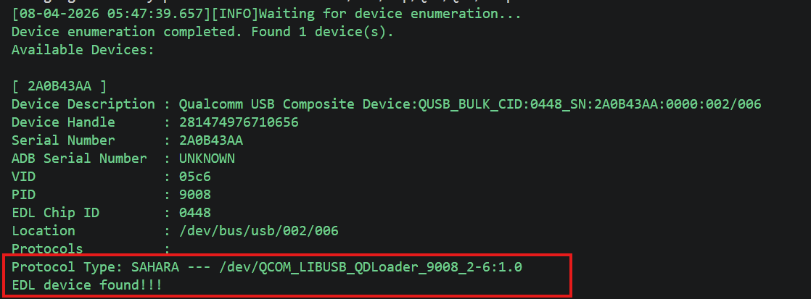

# Overview

The Qualcomm Image Loader (QIL) is a tool for flashing firmware images to Qualcomm-based devices. It supports Windows, Linux and WSL.

## Open Source Repository ##

https://github.com/qualcomm/qualcomm-image-loader

## Distributed Components

QIL is a zipped package with list of below component bundled:

* QIL executable
* QIL User Guide
* Qualcomm User Space Driver (install optional)

## Supported Operating Systems

|OS  |  Description
|---|---|
|Linux x64 | Ubuntu 24.04 and newer|
|Windows x64 | Windows 11 |
|Windows ARM64 | Windows 11 |
|WSL | Ubuntu 24.04 and newer|

## Setup ##

1. Download the zip package for your platform from [Qualcomm Software Center (QSC)](https://softwarecenter.qualcomm.com/) – Search for “Qualcomm Image Loader” 
2. Unzip the downloaded zip package. 
3. Driver installation(optional)- Installing Qualcomm user-space drivers is optional if the Qualcomm kernel drivers are already present. If drivers have not been installed, the user-space driver included in this package may be used as an alternative. Driver installation is a one-time process; please refer to the "README" provided with the accompanying user-space driver zip bundle for detailed installation instructions. 

# Usage #

## Prerequisites ##

Before using QIL, ensure the device is in EDL mode.

### Steps to Put the Device into EDL Mode for build loading ###

There are two methods on how to set a device to edl mode:

1. Use the device hardware button to put the device in EDL mode, if applicable. Refer to your device documentation for details.

    Some devices feature a hardware switch for EDL mode. Common methods:

    * Hold both volume buttons while powering on.

    * Press and hold the F_DL button while powering on.

2. Set the device to EDL via ADB.

    Ensure ADB is installed. Refer to the official Android Debug Bridge (ADB) documentation online for installation instructions.

    Run the following commands to ensure the device is in a good state:

    `adb root`

    `adb wait-for-device`

    `adb shell mount -o remount, rw /`

    `adb wait-for-device`

    Run one of the following command to set the device into EDL mode:

    `adb shell reboot edl`

    or

    `adb reboot edl`

To verify that the device has successfully entered Emergency Download (EDL) mode, run the following command:

`./qil --devices`

### EDL Mode in Linux Verification ###

If the device is in EDL mode, the output will include a line similar to:

`Protocol Type: 3 --- /dev/QCOM_LIBUSB_QDLoader_9008_2-2:1.0  EDL device  found!!!`

(See the screenshot below for an example.) 

Figure 1 - Successfully set device to EDL mode (Linux)

### EDL Mode in Windows Verification ###

If the device is in EDL mode, the output will include a line similar to:

`Protocol Type: SAHARA --- Qualcomm HS-USB QDLoader 9008
EDL device found!!!`

(See the screenshot below for an example.) 

Figure 2 - Successfully set device to EDL mode (Windows)

### EDL Mode in WSL Verification ###

If the device is in EDL mode, the output will include a line similar to:

`Protocol Type: SAHARA --- Qualcomm HS-USB QDLoader 9008
EDL device found!!!`

(See the screenshot below for an example.) 

Figure 2 - Successfully set device to EDL mode (Windows)

## Run QIL ##

Flash a flat build image to a device:

./qil --device=<MSM SN> --flash-build --reset=true --build=/path/to/flat/build --memory-type=UFS

**Note:** If you are using WSL as the host, please add `--zlp-aware-host=false` to ensure proper USB communication, such as:

`./qil --device=<MSM SN> --flash-build --reset=true --build=/path/to/flat/build --memory-type=UFS --zlp-aware-host=false`

For a comprehensive list, refer to [QIL Commands](#qil-commands).

## Supported Features ##

### QIL Commands ###

To view a list of all available commands, run ./qil --help or  ./qil -h from the command line. The following table lists all supported QIL commands, along with a brief description of each command and its required and optional arguments.

See [QIL Arguments](#qil-args) for more information about the arguments.

The following table lists all available arguments, their expected values, and descriptions.

<table>
<tr><th>Command</th><th>Required Arguments</th><th>Optional Arguments</th><th>Command Description</th></tr>
<tr><td colspan="4"><strong>Flash Operations</strong></td></tr>
<tr><td><code>--flash-build</code></td><td style="white-space: nowrap;"><code>--build</code> <code>--device</code> <code>--memory-type</code> <code>--reset</code></td><td style="white-space: nowrap;"><code>--read-image-path</code> <code>--slot</code> <code>--erase</code> <code>--device-programmer</code> <code>--cdt</code> <code>--active-partition</code> <code>--chained-digest</code> <code>--signed-digest</code> <code>--validation-mode</code> <code>--raw-program</code> <code>--partition-index</code> <code>--patch-program</code> <code>--preserve-partitions</code> <code>--skip-sahara</code> <code>--firehose-init-time</code> <code>--firehose-rx-timeout</code> <code>--validate-image-size</code> <code>--port-trace</code> <code>--zlp-aware-host</code> <code>--verbose</code></td><td>Flash firmware build to device.</td></tr>
<tr><td><code>--send-xml</code></td><td style="white-space: nowrap;"><code>--device</code> <code>--device-programmer</code> <code>--memory-type</code> <code>--reset</code> <code>--xml-path</code></td><td style="white-space: nowrap;"><code>--slot</code> <code>--skip-sahara</code> <code>--firehose-init-time</code> <code>--firehose-rx-timeout</code> <code>--port-trace</code> <code>--zlp-aware-host</code> <code>--verbose</code></td><td>Send a firehose command sequence in an XML file. Can be used to send peek command.</td></tr>
<tr><td><code>--send-image</code></td><td style="white-space: nowrap;"><code>--device</code> <code>--device-programmer</code> <code>--memory-type</code> <code>--image-path</code> <code>--lun</code> <code>--reset</code> <code>--start-sector</code></td><td style="white-space: nowrap;"><code>--slot</code> <code>--skip-sahara</code> <code>--firehose-init-time</code> <code>--firehose-rx-timeout</code> <code>--port-trace</code> <code>--zlp-aware-host</code> <code>--verbose</code></td><td>Send a binary image to a user defined region in device (with partition index and start index).</td></tr>
<tr><td colspan="4"><strong>UFS Provisioning</strong></td></tr>
<tr><td><code>--ufs-provision</code></td><td style="white-space: nowrap;"><code>--device</code> <code>--device-programmer</code> <code>--ufs-provision-xml</code></td><td style="white-space: nowrap;"><code>--slot</code> <code>--chained-digest</code> <code>--signed-digest</code> <code>--skip-sahara</code> <code>--firehose-init-time</code> <code>--firehose-rx-timeout</code> <code>--port-trace</code> <code>--zlp-aware-host</code> <code>--verbose</code></td><td>Execute a UFS provision.</td></tr>
<tr><td colspan="4"><strong>Create Digest Files</strong></td></tr>
<tr><td><code>--create-flash-build-vip-digest</code></td><td style="white-space: nowrap;"><code>--build</code> <code>--memory-type</code> <code>--out</code> <code>--reset</code></td><td style="white-space: nowrap;"><code>--slot</code> <code>--erase</code> <code>--cdt</code> <code>--validation-mode</code> <code>--raw-program</code> <code>--patch-program</code> <code>--digest-header-type</code> <code>--port-trace</code> <code>--zlp-aware-host</code> <code>--verbose</code></td><td>Create flash build VIP digest. Offline process, no device needed.</td></tr>
<tr><td><code>--create-ufs-provision-vip-digest</code></td><td style="white-space: nowrap;"><code>--out</code> <code>--ufs-provision-xml</code></td><td style="white-space: nowrap;"><code>--slot</code> <code>--digest-header-type</code> <code>--port-trace</code> <code>--zlp-aware-host</code> <code>--verbose</code></td><td>Create UFS provision VIP digest. Offline process, no device needed.</td></tr>
<tr><td><code>--create-validation-digest</code></td><td style="white-space: nowrap;"><code>--build</code> <code>--memory-type</code> <code>--out</code></td><td style="white-space: nowrap;"><code>--raw-program</code> <code>--port-trace</code> <code>--zlp-aware-host</code> <code>--verbose</code></td><td>Create build validation digest. Offline process, no device needed.</td></tr>
<tr><td colspan="4"><strong>Erase Device Partitions</strong></td></tr>
<tr><td><code>--erase-partitions</code></td><td style="white-space: nowrap;"><code>--device</code> <code>--device-programmer</code> <code>--memory-type</code></td><td style="white-space: nowrap;"><code>--slot</code> <code>--partition-index</code> <code>--skip-sahara</code> <code>--firehose-init-time</code> <code>--firehose-rx-timeout</code> <code>--port-trace</code> <code>--zlp-aware-host</code> <code>--verbose</code></td><td>Erase specified partitions in device.</td></tr>
<tr><td colspan="4"><strong>Read from Device</strong></td></tr>
<tr><td><code>--get-flash-info</code></td><td style="white-space: nowrap;"><code>--device</code> <code>--device-programmer</code> <code>--memory-type</code> <code>--reset</code></td><td style="white-space: nowrap;"><code>--slot</code> <code>--partition-index</code> <code>--skip-lun-info</code> <code>--skip-sahara</code> <code>--firehose-init-time</code> <code>--firehose-rx-timeout</code> <code>--port-trace</code> <code>--zlp-aware-host</code> <code>--verbose</code></td><td>Get device flash information only.</td></tr>
<tr><td><code>--read-images</code></td><td style="white-space: nowrap;"><code>--build</code> <code>--device</code> <code>--memory-type</code> <code>--read-image-path</code> <code>--reset</code></td><td style="white-space: nowrap;"><code>--slot</code> <code>--erase</code> <code>--device-programmer</code> <code>--raw-program</code> <code>--skip-sahara</code> <code>--firehose-init-time</code> <code>--firehose-rx-timeout</code> <code>--port-trace</code> <code>--zlp-aware-host</code> <code>--verbose</code></td><td>Read partition images from device.</td></tr>
<tr><td colspan="4"><strong>Query Devices</strong></td></tr>
<tr><td><code>--devices</code></td><td style="white-space: nowrap;"></td><td style="white-space: nowrap;"><code>--verbose</code></td><td>List all available device identifiers.</td></tr>
<tr><td colspan="4"><strong>Device Control &amp; Utilities</strong></td></tr>
<tr><td><code>--reset-device</code></td><td style="white-space: nowrap;"><code>--device</code></td><td style="white-space: nowrap;"><code>--port-trace</code> <code>--verbose</code></td><td>Reset device from firehose mode. Normally used when the previous command was executed with <code>--reset=false</code>.</td></tr>
<tr><td><code>--help</code>, <code>-h</code></td><td style="white-space: nowrap;"></td><td style="white-space: nowrap;"></td><td>Display help information.</td></tr>
<tr><td><code>--version</code></td><td style="white-space: nowrap;"></td><td style="white-space: nowrap;"></td><td>Display QIL application version.</td></tr>
</table>

 

### QIL Arguments

<table>
<tr><th>Option</th><th>Value</th><th>Description</th></tr>
<tr><td style="white-space: nowrap;"><code>--active-partition</code></td><td><code>&lt;0|1|...&gt;</code></td><td>Set the bootable partition index during flat build download. (e.g., <code>1</code> for UFS and <code>0</code> for eMMC).</td></tr>
<tr><td style="white-space: nowrap;"><code>--build</code></td><td><code>&lt;FLAT_BUILD_PATH&gt;</code></td><td>Absolute path to flat build directory containing: • <strong>Flash images</strong>: Search path for programmer, download binary, or XML • <strong>Create VIP digest</strong>: Search path for download binary or XML • <strong>Create validation digest</strong>: Search path for download binary or XML</td></tr>
<tr><td style="white-space: nowrap;"><code>--cdt</code></td><td><code>&lt;CDT_PATH&gt;</code></td><td>Given absolute path to CDT (Configuration Data Table) binary file. Used to replace CDT binary during --flash-build.</td></tr>
<tr><td style="white-space: nowrap;"><code>--chained-digest</code></td><td><code>&lt;DIGEST_PATH&gt;</code></td><td>Given absolute path or relative path to --build path for chained digest file, used for VIP download. Must be used together with signed digest file. Chained digest file AND signed digest file needs to be created before performing a VIP download. See Digest file creation section.</td></tr>
<tr><td style="white-space: nowrap;"><code>--device</code></td><td><code>&lt;ID&gt;</code></td><td>Specify target device identifier for device operation. Use <code>SERIAL NUMBER</code> or <code>ADB Serial Number</code> or <code>Device Description</code> from <code>--devices</code> command.</td></tr>
<tr><td style="white-space: nowrap;"><code>--device-programmer</code></td><td><code>&lt;PROGRAMMER_PATH&gt;</code></td><td>Given absolute path to a device programmer file or sahara XML used during Sahara transfer. Can be relative path if --build path is also given in some process.</td></tr>
<tr><td style="white-space: nowrap;"><code>--digest-header-type</code></td><td><code>&lt;ELF|MBN&gt;</code></td><td>Configure digest header type for VIP digest only used in create VIP digest. If --digest-header-type is not set, will create MBN type digest.</td></tr>
<tr><td style="white-space: nowrap;"><code>--erase</code></td><td></td><td>Specify enabling erasure of a specific partition before download. If --partition-index is not specified, it will erase default configuration (0,1,2,4,5 for UFS and 0 for eMMC).</td></tr>
<tr><td style="white-space: nowrap;"><code>--firehose-init-time</code></td><td><code>&lt;TIME_IN_MS&gt;</code></td><td>Configure firehose initialization time in ms. Increase for slower devices or connections.</td></tr>
<tr><td style="white-space: nowrap;"><code>--firehose-rx-timeout</code></td><td><code>&lt;TIME_IN_MS&gt;</code></td><td>Configure firehose data reception timeout in ms. Increase for slower devices or connections.</td></tr>
<tr><td style="white-space: nowrap;"><code>--image-path</code></td><td><code>&lt;IMAGE_PATH&gt;</code></td><td>Specify binary image path for --send-image.</td></tr>
<tr><td style="white-space: nowrap;"><code>--partition-index</code></td><td><code>&lt;PARTITION_INDEXES&gt;</code></td><td>Comma-separated list of partition indexes to erase during download, erase partition only or get flash info. • Flash Images: Only erase specified partition, but this does not impact the download partition which is configured by rawprogram • Get flash info: Specify the partition index to get information on • Erase flash only: Specify the flash partition to be erased.</td></tr>
<tr><td style="white-space: nowrap;"><code>--patch-program</code></td><td><code>&lt;PATCH_XML_LIST&gt;</code></td><td>Semicolon-separated list of patch XML files. Specify dedicated XML files to override auto-detection of patch files, only used in download build.</td></tr>
<tr><td style="white-space: nowrap;"><code>--lun</code></td><td><code>&lt;LUN_NUMBER&gt;</code></td><td>Configure partition index for --send-image.</td></tr>
<tr><td style="white-space: nowrap;"><code>--memory-type</code></td><td><code>&lt;UFS|EMMC|NAND|SPINOR&gt;</code></td><td>Specify type of flash memory on the target device.</td></tr>
<tr><td style="white-space: nowrap;"><code>--port-trace</code></td><td></td><td>Enable port trace logging. Writes raw TX/RX data to port-trace files in the log directory for protocol-level debugging.</td></tr>
<tr><td style="white-space: nowrap;"><code>--raw-program</code></td><td><code>&lt;RAW_XML_LIST&gt;</code></td><td>Semicolon-separated list of rawprogram XML files. Specify dedicated XML file if you don't want to use default list, only used in download build &amp; read images.</td></tr>
<tr><td style="white-space: nowrap;"><code>--read-image-path</code></td><td><code>&lt;DIR_PATH_FOR_READ&gt;</code></td><td>Directory path to store read-out binary images:<ul><li>Flash build: Stores binaries read back from device during validation (validation-mode 1 or 3 only)</li><li>Read images: Output directory for partition images read from device</li></ul></td></tr>
<tr><td style="white-space: nowrap;"><code>--reset</code></td><td><code>&lt;true|false&gt;</code></td><td>Enable or disable reset device after firehose process completion. Device will remain in firehose mode if set to false.</td></tr>
<tr><td style="white-space: nowrap;"><code>--signed-digest</code></td><td><code>&lt;DIGEST_PATH&gt;</code></td><td>Given absolute path or relative path to --build path for signed digest file, used for VIP download. Signed digest file needs to be created before performing a VIP download. See Digest file creation section.</td></tr>
<tr><td style="white-space: nowrap;"><code>--skip-lun-info</code></td><td></td><td>Enable skipping getting detailed LUN info for --get-flash-info.</td></tr>
<tr><td style="white-space: nowrap;"><code>--skip-sahara</code></td><td></td><td>While device already in firehose mode. Enable skipping the transfer of device programmer using Sahara. Normally used in a subsequent command when the previous command was executed with '--reset=false' or when the previous command failed and the device remains in firehose mode.</td></tr>
<tr><td style="white-space: nowrap;"><code>--slot</code></td><td><code>&lt;SLOT_INDEX&gt;</code></td><td>Configure Memory slot number. Default to slot 0 if not specified.</td></tr>
<tr><td style="white-space: nowrap;"><code>--start-sector</code></td><td><code>&lt;START_SECTOR_NUMBER&gt;</code></td><td>Configure start sector for --send-image.</td></tr>
<tr><td style="white-space: nowrap;"><code>--out</code></td><td><code>&lt;DIR_PATH_FOR_READ&gt;</code></td><td>Output path to save generated digest file. Must be used inside create VIP digest or build validation digest process.</td></tr>
<tr><td style="white-space: nowrap;"><code>--ufs-provision-xml</code></td><td><code>&lt;PROVISION_XML&gt;</code></td><td>Given absolute path to UFS provision XML file. Only used together with --ufs-provision &amp; --create-ufs-provision-vip-digest.</td></tr>
<tr><td style="white-space: nowrap;"><code>--validate-image-size</code></td><td></td><td>Validate image sizes against rawprogram.xml during download. Compares image file sizes with sizes specified in rawprogram.xml and fails if any image exceeds the defined size.</td></tr>
<tr><td style="white-space: nowrap;"><code>--validation-mode</code></td><td><code>&lt;0|1|2|3|4&gt;</code></td><td>Validate firmware images during download. No validation if not specified:<ul><li>0 - No validation</li><li>1 - Binary Readback: Read back binary data from mobile -&gt; create digest 1 from those flash data -&gt; read original download binary file -&gt; create digest 2 for download file in runtime -&gt; compare digest 2 with digest 1</li><li>2 - SHA256 Readback: Read digest 1 from mobile directly -&gt; read download binary file -&gt; create digest 2 for original download file in runtime -&gt; compare digest 2 with digest 1</li><li>3 - Binary readback with digest file (Requires Build Validation File): Read back binary data from mobile -&gt; create digest 1 from those flash data -&gt; load pre-created digest 2 from file -&gt; compare digest 2 with digest 1</li><li>4 - SHA256 Readback with digest file (Requires Build Validation File): Read digest 1 from mobile directly -&gt; load pre-created digest 2 from file -&gt; compare digest 2 with digest 1</li></ul></td></tr>
<tr><td style="white-space: nowrap;"><code>--verbose</code></td><td></td><td>Enable verbose logging output. Shows detailed operation logs and debug information.</td></tr>
<tr><td style="white-space: nowrap;"><code>--xml-path</code></td><td><code>&lt;XML_PATH&gt;</code></td><td>Configure command XML file path used by --send-xml. Can be used to send peek command.</td></tr>
<tr><td style="white-space: nowrap;"><code>--zlp-aware-host</code></td><td><code>&lt;true|false&gt;</code></td><td>Enable or disable ZLP (Zero Length Packet) aware host for USB transfers. <strong>Important:</strong> If you are using WSL (Windows Subsystem for Linux) as the host, please set this to <code>false</code> (i.e., <code>--zlp-aware-host=false</code>) to ensure proper USB communication.</td></tr>
</table>

## Logs

Debug logs capture detailed information about QIL operations and can assist in troubleshooting. They can be found in the following location:
### Linux ###
`/var/tmp/QFS/QIL/Logs/`

### Windows ###
`C:\ProgramData\QFS\QIL\Logs\`

### WSL ###

`/var/tmp/QFS/QIL/Logs/`

## Limitations
1. **EDL Mode Required**

   All QIL device operations require the device to be in EDL mode. If the device is not in EDL mode, commands such as `./qil --devices` will not detect it. See the [EDL mode](#edl-mode) section for setup instructions.

2. **Single Device at a Time**

   QIL supports flashing only one device at a time. Multi-device parallel operations are not supported.

## FAQ

Below are some common issues and their solutions.

1. QIL reports that the device has not been found.

    Please ensure Qualcomm Drivers have been installed. See the [Setup](#qil-setup) section for details.

    If drivers are installed and the device is still not detected, try stopping ADB. While QIL can run alongside ADB in most cases, stopping the ADB server may help resolve detection issues:

   `adb kill-server`

2. QIL reports that the device is not in EDL mode.

    Please ensure that the device has been set to EDL mode. See [EDL mode](#edl-mode) section for details.
